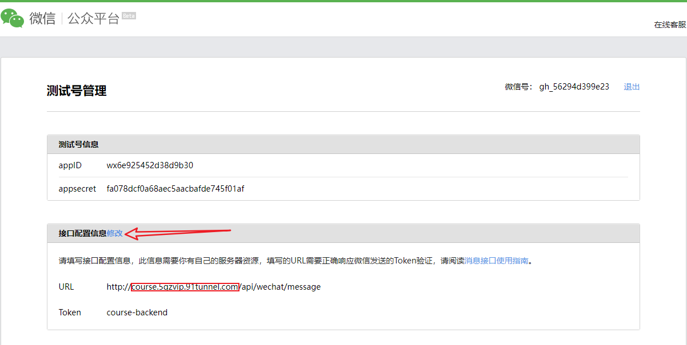
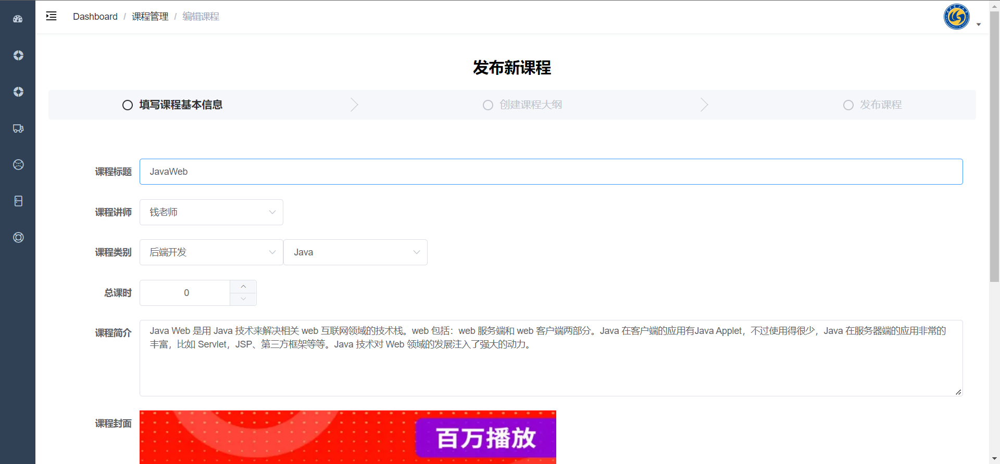
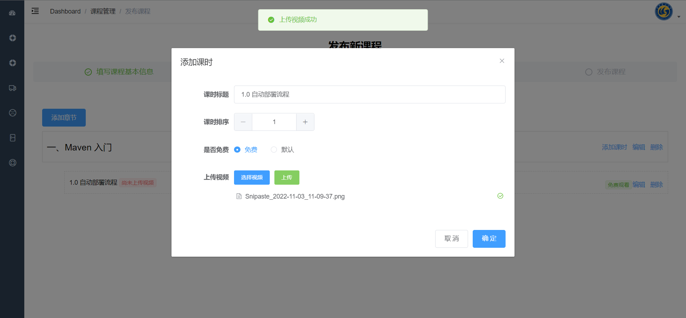
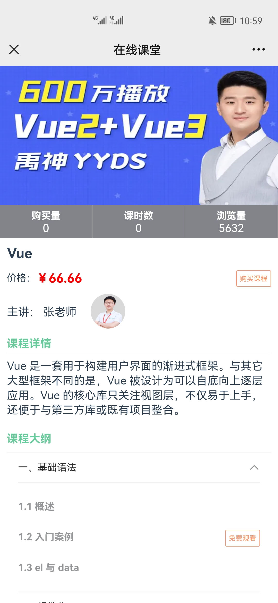

<p align="center">
    
    
    
     
    <a href="https://github.com/springbear2020/atguigu-course" target="_blank">
        
    </a>
</p>

# 一、快速开始

## 1.1 后端服务系统

1. 克隆仓库：使用 Git 克隆仓库或直接下载仓库压缩包到您的计算机来获取源代码。

2. 打开工程：使用 IntelliJ IDEA 开发工具打开 course-server 后端服务系统模块，而后使用 Maven 项目构建工具更新工程模块依赖。

3. 创建数据库并导入数据：登录 MySQL 控制台，依据 document/sql 目录下的 7 个 SQL 脚本文件创建七个数据库，并导入数据库表和数据。

4. 修改配置：

   - 修改 course-server/service/service-\*/\*\*/application.yml 六个模块中的数据库连接信息，设置你自己的数据库用户名和密码。
   - 修改 course-server/service/service-\*/\*\*/application.yml 六个模块中的 Nacos 配置信息，设置你的 Nacos 地址和端口，默认配置为 localhost:8848。

5. 可选配置：

   - course-server/service/service-live/\*\*/application.properties：修改 [欢拓云](https://www.talk-fun.com/) 直播平台配置信息，若不修改则后台管理系统（course-backend）中直播课程相关的 CRUD 功能异常。

   - course-server/service/service-user/\*\*/application.properties：修改 [微信公众号测试号](https://mp.weixin.qq.com/debug/cgi-bin/sandbox?t=sandbox/login) 的应用 ID 信息和应用密钥以及用户同意授权个人信息后的回调地址。

     注意此回调地址需为公网地址才能被微信平台识别，**并且需要在微信公众号测试号中配置网页账号授权回调页面域名，详见 1.4。** 若不修改则手机端微信公众号中的相关功能均不可用。

   - course-server/service/service-vod/\*\*/application.properties：修改 [腾讯云对象存储](https://cloud.tencent.com/product/cos) 的存储空间信息和 [腾讯云视频点播](https://cloud.tencent.com/product/vod) 服务的应用 ID 信息。若不修改则腾讯云相关图片存储服务不可用，课程小节视频不能上传和查看。

   - course-server/service/service-wechat/\*\*/application.properties：修改微信公众号测试号的配置信息以及接口配置信息，**并且需要在微信公众号测试号中填写接口配置信息，详见 1.4。** 若不修改则手机端微信公众号一切功能异常。同时还需要修改微信公众号页面的服务器地址，也即 course-mobile 项目的部署地址，此地址需为公网地址以供微信后台调用，若不修改则微信公众号中的查看课程信息功能异常，不能跳转到任何页面。

   > 注：service-user 和 service-wechat 中用到的公网域名地址可通过配置内网穿透的方式实现，具体可参看 [Ngrok](https://ngrok.cc/) 内网转发工具。具体来说，需要配置两个内网穿透地址：

   - 第一个内网穿透地址映射到后端服务系统（course-server）网关模块端口，即 http://course.5gzvip.91tunnel.com -> http://localhost:8888。
   - 第二个内网穿透地址映射到移动应用系统（course-mobile）所监听的端口，即 http://mobile.vipgz4.91tunnel.com -> http://localhost:8080。

   | 工程名                         | 子模块           | 端口 |           内网穿透地址            |
   | :----------------------------- | :--------------- | :--: | :-------------------------------: |
   | course-server（后端服务系统）  |                  |      |                                   |
   |                                | gateway          | 8888 | http://course.5gzvip.91tunnel.com |
   |                                | service-vod      | 8081 |                                   |
   |                                | service-order    | 8082 |                                   |
   |                                | service-activity | 8083 |                                   |
   |                                | service-user     | 8084 |                                   |
   |                                | service-wechat   | 8085 |                                   |
   |                                | service-live     | 8086 |                                   |
   | course-mobile（移动应用系统）  |                  | 8080 | http://mobile.vipgz4.91tunnel.com |
   | course-backend（后台管理系统） |                  | 9528 |                                   |

6. 启动 Nacos 服务：进入 Nacos 安装目录下的 bin 目录，在控制台以 startup.cmd -m standalone 命令以单机模式启动 Nacos 服务。

7. 启动后端服务系统：在 IDEA 中批量启动所有后台服务，包括一个网关（gateway）和六个业务服务（service-\*）。

## 1.2 后台管理系统

> 注：请确保 **1.1 后端服务系统** 中的一个网关和六个业务服务正常启动以提供正常的接口功能。

1. 克隆仓库：使用 Git 克隆仓库或直接下载仓库压缩包到您的计算机来获取源代码。
2. 打开工程：使用 WebStorm 开发工具打开 course-backend 后台管理系统模块。
3. 安装依赖：在控制台使用 npm install 命令安装工程所需依赖。
4. 修改配置：
   - course-backend/.env.development：修改该文件中的  VUE_APP_BASE_API 变量的值为后端服务系统网关地址，默认为：http://localhost:8888， 即 1.1 后端服务系统中网关模块的 IP 地址和端口信息。
5. 启动系统：在控制台使用 npm run dev 命令启动工程，启动成功即可进入后台管理系统登录页。

## 1.3 移动应用系统

> 注：请确保 **1.1 后端服务系统** 中的一个网关和六个业务服务正常启动以提供正常的接口功能。

1. 克隆仓库：使用 Git 克隆仓库或直接下载仓库压缩包到您的计算机来获取源代码。
2. 打开工程：使用 WebStorm 开发工具打开 course-mobile 移动应用系统模块。
3. 安装依赖：在控制台使用 npm install 命令安装工程所需依赖。
4. 修改配置：
   - course-mobile/utils/request.js：修改该文件中的  BASE_REQUEST_URL 变量的值为后端服务系统网关模块的内网穿透地址。
5. 启动系统：在控制台使用 npm run serve 命令启动工程。

## 1.4 微信公众号

1. 申请 [微信公众号测试号](https://mp.weixin.qq.com/debug/cgi-bin/sandbox?t=sandbox/login)，在微信公众号测试号中配置网页账号授权回调页面域名。

   

2. 配置公众号测试号的接口配置信息，只需要修改公网域名部分即可，即修改 course.5gzvip.91tunnel.com 为你自己的公网域名。

   

3. 在后台管理系统中同步公众号菜单信息。

4. 关注公众号并在手机端测试公众号的相关功能。

系统整个网络穿透配置和请求响应流程如下图：


# 二、项目介绍

硅谷课堂是尚硅谷与腾讯云官方合作推出的项目，是一款基于微信公众号 B2C 模式的在线学习平台，该平台包含三大模块：直播、教学与微信消息服务。

平台会定期推出直播课程，方便学员与名师之间的交流互动，学员也可以购买教学视频在线学习，分享直播与教学视频获取平台收益。平台支持直播、腾讯云视频点播、微信支付、微信授权登录、微信菜单、微信消息与腾讯云文件存储等一系列功能，为学员构建了一个全方位的在线学习平台。

硅谷课堂项目具有很强的实用性，业务场景贴近实际，技术应用紧跟市场潮流，完全按照市场需求开发。既是对主流 Java 技术的系统性梳理和整合，同时也是各种主流技术实际应用的练兵场，能够帮助 Java 程序员积累项目经验。

# 三、系统流程


# 四、功能架构


# 五、技术架构


# 六、工程结构

```lua
course-backend 	-- 父工程，统一依赖管理
├── client 			-- 客户端，通过 Spring Cloud Feign 提供服务
    ├── activity 	-- 营销活动相关服务
    ├── order 		-- 订单 api 接口
    ├── user 		-- 用户 api 接口
    ├── vod 		-- 课程点播 api 接口
├── common 		-- 通用模块
    ├── model 		-- 通用数据模型
    ├── util 		-- 通用工具类
├── gateway 	-- 服务网关，统一管理各种 service 服务，解决跨域问题
├── service 	-- 提供服务，为前后台提供具体服务
    ├── live 		-- 营销活动相关服务
    ├── model 		-- 直播课程相关服务
    ├── order 		-- 订单相关服务
    ├── user 		-- 用户相关服务
    ├── vod 		-- 课程点播相关服务
    ├── wechat 		-- 微信公众号相关服务
```

# 七、技术选型

| 技术                       | 说明                  |
| :------------------------- | :-------------------- |
| Spring Boot                | Spring 快速开发脚手架 |
| Spring Cloud Gateway       | Spring 网关           |
| Spring Cloud Alibaba Nacos | 微服务注册中心        |
| Spring Cloud Feign         | 远程服务调用          |
| MyBatis Plus               | ORM 框架              |
| MySQL                      | 关系数据库            |
| Easy Excel                 | Java excel 操作工具   |
| Swagger                    | 项目文档生成工具      |
| JWT                        | 跨域认证解决方案      |
| Lombok                     | 简化 POJO 类开发      |
|                            |                       |
| Vue.js                     | JavaScript 框架       |
| Axios                      | 请求库                |
| ElementUI                  | 桌面端组件库          |
| Vant                       | 移动端组件库          |
|                            |                       |
| 腾讯云对象存储             | 对象存储              |
| 腾讯云视频点播             | 视频点播              |
| 欢拓云直播                 | 视频直播              |
| 微信公众号                 | 公众号                |

# 八、效果展示

## 8.1 后台管理系统

### 8.1.1 管理员

1. 管理员登录页

   

2. 管理员欢迎页

   

### 8.1.2 讲师管理

1. 新增讲师：填写讲师必要信息，上传讲师头像到腾讯云对象存储平台进行图片保存。

   

2. 删除讲师

   

3. 编辑讲师：选定需要编辑的讲师，回显讲师信息，保存后更新讲师信息。

   

4. 查询讲师：可根据讲师姓名、头衔等信息查询展示讲师。

   

### 8.1.3 课程分类管理

1. 导入课程分类：选中保存有课程分类的 excel 文件，上传到服务器，由服务器解析并保存课程分类信息。

   

2. 导出课程分类：选定导出课程分类按钮，由服务器处理课程分类信息并写入 excel 文件供下载。

   

3. 查询课程分类：课程分类信息 “懒加载” 展示。

   

### 8.1.4 课程管理

1. 新增课程：填入课程必要信息，选择课程分类信息，上传课程封面。

   

2. 删除课程

   

3. 编辑课程

   

4. 查询课程：可根据课程分类信息、课程名称以及课程讲师信息查询课程。

   

5. 课程访客统计

   

6. 编辑课程大纲：一门课程下有多个章节，一个章节包含多个小节，一个课程小节对应一份课程视频。

   

7. 新增课程章节

   

8. 上传课程小节视频：选择课程小节视频，上传到腾讯云视频点播平台。

   

9. 发布课程：将课程修改为已发布状态。

   

### 8.1.5 优惠券管理

1. 新增优惠券

   

2. 删除优惠券

   

3. 编辑优惠券

   

4. 优惠券详情：展示优惠券及已使用的优惠券信息。

   

### 8.1.6 公众号菜单管理

1. 添加公众号菜单

   

2. 修改公众号菜单

   

3. 同步公众号菜单：同步公众号菜单后最新的菜单信息将同步到微信公众号中。

   

4. 公众号菜单列表

   

### 8.1.7 课程订单管理

订单查询：根据订单号、手机号等信息查询用户的课程订单信息。


### 8.1.8 直播管理

1. 新增直播

   

2. 删除直播

   

3. 编辑直播

   

4. 直播配置

   

5. 直播账号

   

## 8.2 微信公众号

### 8.2.1 消息提醒

1. 关注公众号

   

2. 关于我子菜单

   

### 8.2.2 课程信息

1. 关键字查询课程

   

2. 课程分类子菜单

   

3. 课程分类列表

   

4. 课程详情

   

5. 课程视频播放

   

### 8.2.3 购买课程

1. 购买课程

   

2. 兑换优惠券

   

3. 不可用优惠券

   

4. 可用优惠券

   

5. 模拟订单支付

   

6. 课程购买成功

   

7. 支付消息推送

   

# 九、许可证

```
MIT License

Copyright (c) 2023 Spring-_-Bear

Permission is hereby granted, free of charge, to any person obtaining a copy
of this software and associated documentation files (the "Software"), to deal
in the Software without restriction, including without limitation the rights
to use, copy, modify, merge, publish, distribute, sublicense, and/or sell
copies of the Software, and to permit persons to whom the Software is
furnished to do so, subject to the following conditions:

The above copyright notice and this permission notice shall be included in all
copies or substantial portions of the Software.

THE SOFTWARE IS PROVIDED "AS IS", WITHOUT WARRANTY OF ANY KIND, EXPRESS OR
IMPLIED, INCLUDING BUT NOT LIMITED TO THE WARRANTIES OF MERCHANTABILITY,
FITNESS FOR A PARTICULAR PURPOSE AND NONINFRINGEMENT. IN NO EVENT SHALL THE
AUTHORS OR COPYRIGHT HOLDERS BE LIABLE FOR ANY CLAIM, DAMAGES OR OTHER
LIABILITY, WHETHER IN AN ACTION OF CONTRACT, TORT OR OTHERWISE, ARISING FROM,
OUT OF OR IN CONNECTION WITH THE SOFTWARE OR THE USE OR OTHER DEALINGS IN THE
SOFTWARE.
```

